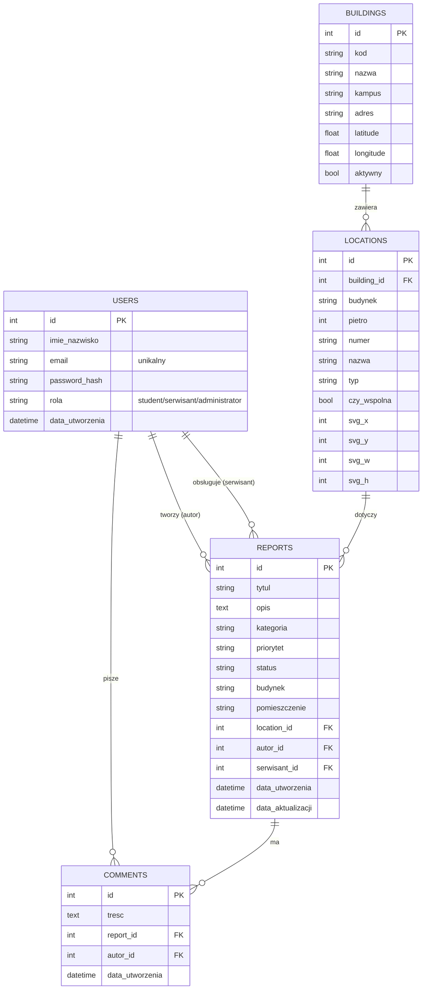

# Dokumentacja projektu: System zgłaszania usterek na uniwersytecie

## Zespół projektowy
- **Kamil Antoni Krawczyk**
- **Patryk Kacper Długosz**

---

## Opis projektu
Aplikacja webowa stworzona w języku **Python (Flask)**, która służy do cyfryzacji
procesu zgłaszania awarii na terenie kampusu Uniwersytetu Rzeszowskiego. System
pozwala odejść od papierowych formularzy na rzecz szybkiej, śledzonej komunikacji
między społecznością akademicką a działem technicznym. Lokalizację usterki wybiera
się wizualnie — na mapie kampusu (markery budynków z GPS) oraz na interaktywnym
planie piętra, na którym sale zmieniają kolor zależnie od statusu zgłoszeń.

---

## Zakres projektu i opis funkcjonalności
Głównym celem aplikacji jest pełna cyfryzacja procesu zgłaszania oraz obsługi
usterek technicznych na terenie kampusu. System zapewnia efektywny przepływ
informacji między zgłaszającymi a serwisem.

- **System autoryzacji i ról:** rejestracja i logowanie z hasłami przechowywanymi
  jako bezpieczny hash. Trzy poziomy uprawnień:
  - `student` – zgłaszający (student/pracownik): tworzy zgłoszenia i widzi wyłącznie własne,
  - `serwisant` – technik: widzi wszystkie zgłoszenia, zmienia statusy, przyjmuje je do realizacji,
  - `administrator` – pełne uprawnienia: zarządzanie użytkownikami, budynkami i usuwanie zgłoszeń.
- **Moduł zgłoszeniowy:** formularz z walidacją pól pozwalający precyzyjnie określić
  lokalizację (budynek → piętro → sala wybierane z mapy/list), kategorię usterki
  (IT / Komputery, Elektryka, Hydraulika, Meble, Ogrzewanie / Klimatyzacja,
  Budynek / Konstrukcja, Inne) oraz dodać tytuł i opis problemu.
- **Zarządzanie statusem zgłoszenia:** śledzenie postępu prac. Każde zgłoszenie może
  przyjmować statusy: **Nowe → W trakcie → Wstrzymane** (oczekiwanie na części) →
  **Rozwiązane** lub **Odrzucone**. Serwisant może też przypisać do zgłoszenia konkretnego technika.
- **Priorytetyzacja zadań:** określenie pilności zgłoszenia (Niski, Średni, Wysoki,
  Krytyczny), co pozwala na szybszą reakcję przy awariach krytycznych. Priorytet
  wpływa też na kolor sali na planie piętra.
- **Komentarze:** wątek komentarzy pod każdym zgłoszeniem (komunikacja zgłaszający ↔ serwisant).
- **Mapa kampusu i plan piętra:** budynki UR jako markery z GPS (Leaflet + OpenStreetMap)
  oraz interaktywny plan piętra generowany z bazy danych, z możliwością przełączania
  budynku i piętra.
- **Baza danych i archiwizacja:** przechowywanie pełnej historii zgłoszeń, dat
  utworzenia i aktualizacji, co umożliwia analizę najczęstszych awarii.

---

## Panele / zakładki aplikacji
Interfejs zaprojektowano modułowo, co ułatwia nawigację i przyspiesza obsługę:

- **Panel logowania:** ekran autoryzacji użytkownika; z odnośnikiem do rejestracji.
- **Pulpit (Dashboard):** ekran powitalny ze statystykami zgłoszeń wg statusu oraz
  listą ostatnich zgłoszeń (student widzi własne, serwisant/administrator – wszystkie).
- **Mapa:** interaktywny plan piętra z salami kolorowanymi wg statusu usterek;
  listy wyboru budynku i piętra; kliknięcie sali pokazuje jej zgłoszenia.
- **Nowe zgłoszenie:** formularz z mapą kampusu i kaskadą budynek → sala oraz walidacją pól.
- **Zgłoszenia (Historia):** lista zgłoszeń z filtrowaniem po statusie, kategorii
  i priorytecie; przejście do szczegółów, komentarzy i (dla serwisu) edycji statusu.
- **Panel administratora / serwisanta:**
  - **Budynki** – zarządzanie markerami na mapie (dodawanie budynku przez kliknięcie na mapie, ukrywanie/pokazywanie),
  - **Użytkownicy** – pełna edycja profili (imię, e-mail, rola, reset hasła).
- **Moje konto:** edycja własnych danych (imię i nazwisko, e-mail, zmiana hasła).

---

## Baza danych

### Diagram ERD


### Opis bazy danych
Baza to plik **SQLite** (`instance/usterki.db`), obsługiwany przez ORM
**SQLAlchemy**. Tworzy się automatycznie przy pierwszym uruchomieniu i — gdy jest
pusta — wypełnia danymi przykładowymi (`app/seed.py`). Tabele:

- **users** – konta użytkowników wraz z rolą i hasłem (hash). Jeden użytkownik może
  być autorem wielu zgłoszeń oraz serwisantem przypisanym do wielu zgłoszeń.
- **reports** – zgłoszenia usterek; powiązane z autorem, opcjonalnym serwisantem oraz
  lokalizacją (salą). Przechowują kategorię, priorytet, status i daty.
- **comments** – komentarze pod zgłoszeniami; powiązane ze zgłoszeniem i autorem
  (usuwane kaskadowo wraz ze zgłoszeniem).
- **buildings** – budynki kampusu (markery na mapie) ze współrzędnymi GPS.
- **locations** – pomieszczenia (sale) w budynkach, z geometrią planu piętra (SVG);
  każdy budynek ma własny zestaw 50 sal w podziale na piętra.

---

## Wykorzystane biblioteki
- **Flask 3.0.3** – framework webowy (routing, szablony, obsługa żądań).
- **Flask-SQLAlchemy 3.1.1** – integracja ORM SQLAlchemy z Flask (modele, baza).
- **Flask-Login 0.6.3** – uwierzytelnianie, sesje i ochrona widoków (`login_required`).
- **Werkzeug** – bezpieczne haszowanie haseł (`generate/check_password_hash`).
- **Jinja2** – silnik szablonów HTML.
- **SQLite** – wbudowana, plikowa baza danych (bez osobnego serwera).
- **Leaflet 1.9.4 + OpenStreetMap** (frontend, z CDN) – mapa kampusu z markerami budynków.
- **HTML / CSS / JavaScript** – warstwa interfejsu (własny arkusz `style.css`).

> Projekt korzysta wyłącznie z bibliotek wymienionych w `requirements.txt`
> (pozostałe zależności instalują się automatycznie jako zależności pośrednie).

---

## Dane potrzebne do konfiguracji podczas pierwszego uruchomienia
Aplikacja **nie wymaga ręcznej konfiguracji** – baza danych i dane przykładowe
tworzą się automatycznie. Opcjonalnie można nadpisać ustawienia zmiennymi środowiskowymi:

| Zmienna | Znaczenie | Domyślnie |
|---|---|---|
| `SECRET_KEY` | klucz do podpisywania sesji/ciasteczek | wartość wbudowana |
| `DATABASE_URL` | adres bazy danych | lokalny SQLite `instance/usterki.db` |
| `PORT` | port serwera | `8000` |

**Konta demonstracyjne** (tworzone automatycznie przy pierwszym uruchomieniu):

| Rola | E-mail | Hasło |
|------|--------|-------|
| Administrator | `admin@ur.edu.pl` | `admin123` |
| Serwisant | `serwis@ur.edu.pl` | `serwis123` |
| Student | `student@ur.edu.pl` | `student123` |

---

## Instrukcja uruchomienia aplikacji
Wymagany **Python 3.13**. W terminalu (PowerShell), w katalogu projektu:

```powershell
# 1. Utwórz wirtualne środowisko
python -m venv .venv

# 2. Aktywuj je
.\.venv\Scripts\Activate.ps1

# 3. Zainstaluj zależności
pip install -r requirements.txt

# 4. Uruchom aplikację
python run.py
```

Następnie otwórz w przeglądarce: **http://127.0.0.1:8000**

> Uwaga: na Windows port 5000 bywa zablokowany (Hyper-V/WSL → błąd WinError 10013),
> dlatego aplikacja domyślnie startuje na porcie **8000**. Inny port ustawisz tak:
> `$env:PORT = "5500"; python run.py`

**Reset bazy danych:** aby zacząć od zera, usuń plik `instance/usterki.db`
i uruchom aplikację ponownie (dane przykładowe utworzą się na nowo).

---

## Struktura projektu
```
Projekt PYTHON/
├── run.py                  # punkt wejścia (uruchomienie serwera)
├── config.py               # konfiguracja (klucz, baza danych)
├── requirements.txt        # zależności
├── README.md               # dokumentacja
└── app/
    ├── __init__.py         # fabryka aplikacji, rozszerzenia
    ├── models.py           # modele bazy: User, Report, Comment, Building, Location
    ├── auth.py             # logowanie, rejestracja, edycja konta
    ├── main.py             # zgłoszenia, mapa, panel administratora
    ├── seed.py             # dane przykładowe (budynki, sale)
    ├── static/
    │   ├── style.css       # arkusz stylów
    │   └── img/ur-logo.png # logo Uniwersytetu Rzeszowskiego
    └── templates/          # szablony HTML (Jinja2)
```
