# Dokumentacja projektu: System zgłaszania usterek na uniwersytecie

## Zespół projektowy
- **Kamil Antoni Krawczyk**
- **Patryk Kacper Długosz**

---

## Opis projektu
Aplikacja webowa stworzona w języku **Python (Flask)**, która służy do cyfryzacji
procesu zgłaszania awarii na terenie kampusu Uniwersytetu Rzeszowskiego. System
pozwala odejść od papierowych formularzy na rzecz szybkiej, śledzonej komunikacji
między społecznością akademicką a działem technicznym. Lokalizację usterki wybiera
się wizualnie — na mapie kampusu (markery budynków z GPS) oraz na interaktywnym
planie piętra, na którym sale zmieniają kolor zależnie od statusu zgłoszeń.

---

## Zakres projektu i opis funkcjonalności
Głównym celem aplikacji jest pełna cyfryzacja procesu zgłaszania oraz obsługi
usterek technicznych na terenie kampusu. System zapewnia efektywny przepływ
informacji między zgłaszającymi a serwisem.

- **System autoryzacji i ról:** rejestracja i logowanie z hasłami przechowywanymi
  jako bezpieczny hash. Trzy poziomy uprawnień:
  - `student` – zgłaszający (student/pracownik): tworzy zgłoszenia i widzi wyłącznie własne,
  - `serwisant` – technik: widzi i obsługuje **tylko zgłoszenia ze swojego zasięgu**
    (przypisane kategorie *oraz* budynki) plus te przydzielone mu bezpośrednio,
  - `administrator` – pełne uprawnienia: tworzenie użytkowników, zarządzanie ich rolami
    i zasięgiem, zarządzanie budynkami i pomieszczeniami, rozdysponowywanie zgłoszeń
    spoza zasięgu serwisantów oraz usuwanie zgłoszeń.
- **Zasięg serwisanta (specjalizacje + budynki):** administrator przydziela każdemu
  serwisantowi kategorie, w których się specjalizuje, oraz budynki, które obsługuje.
  W panelu serwisanta (pulpit, lista zgłoszeń, mapa) widoczne są wyłącznie zgłoszenia
  pasujące jednocześnie do jego kategorii i budynków – pozostałe są dla niego ukryte.
- **Rozdysponowanie zgłoszeń:** zgłoszenia spoza zasięgu jakiegokolwiek serwisanta
  (np. „inne” kategorie) trafiają do administratora na zakładkę **„Do rozdysponowania”**,
  gdzie może je ręcznie przydzielić dowolnemu serwisantowi jako zamiennikowi – nawet
  jeśli ten nie ma danej kategorii w specjalizacjach (przypisane zgłoszenie pojawia się
  wtedy w jego panelu).
- **Zarządzanie pomieszczeniami i piętrami:** administrator dodaje dowolną liczbę sal
  na piętrze (bez sztywnej siatki slotów) i układa je na **interaktywnym planie metodą
  „przeciągnij i upuść”** (zmiana pozycji oraz rozmiaru, zapis automatyczny). Na wąskich
  ekranach plan zastępuje responsywna siatka kart. Przycisk **„Auto-układ”** porządkuje
  sale jednym kliknięciem. Pełne korytarze można dodać jako szerokie strefy wspólne.
- **Moduł zgłoszeniowy:** formularz z walidacją pól pozwalający precyzyjnie określić
  lokalizację (budynek → piętro → sala wybierane z mapy/list), kategorię usterki
  (IT / Komputery, Elektryka, Hydraulika, Meble, Ogrzewanie / Klimatyzacja,
  Budynek / Konstrukcja, Inne) oraz dodać tytuł i opis problemu.
- **Zarządzanie statusem zgłoszenia:** śledzenie postępu prac. Każde zgłoszenie może
  przyjmować statusy: **Nowe → W trakcie → Wstrzymane** (oczekiwanie na części) →
  **Rozwiązane** lub **Odrzucone**. Serwisant może też przypisać do zgłoszenia konkretnego technika.
- **Priorytetyzacja zadań:** określenie pilności zgłoszenia (Niski, Średni, Wysoki,
  Krytyczny), co pozwala na szybszą reakcję przy awariach krytycznych. Priorytet
  wpływa też na kolor sali na planie piętra.
- **Komentarze:** wątek komentarzy pod każdym zgłoszeniem (komunikacja zgłaszający ↔ serwisant).
- **Mapa kampusu i plan piętra:** budynki UR jako markery z GPS (Leaflet + OpenStreetMap)
  oraz interaktywny plan piętra generowany z bazy danych, z możliwością przełączania
  budynku i piętra.
- **Lista i historia zgłoszeń:** przegląd zgłoszeń z filtrowaniem po statusie,
  kategorii i priorytecie oraz przejściem do szczegółów i komentarzy.
- **Konto użytkownika („Moje konto”):** edycja własnych danych (imię i nazwisko,
  e-mail) oraz zmiana hasła.
- **Baza danych i archiwizacja:** przechowywanie pełnej historii zgłoszeń, dat
  utworzenia i aktualizacji, co umożliwia analizę najczęstszych awarii.

### Widoki według roli
System obsługuje trzy role, a każdy ekran dostosowuje zakres danych i dostępne akcje
do zalogowanego użytkownika. Wspólnym punktem wejścia jest ekran logowania:

<p align="center">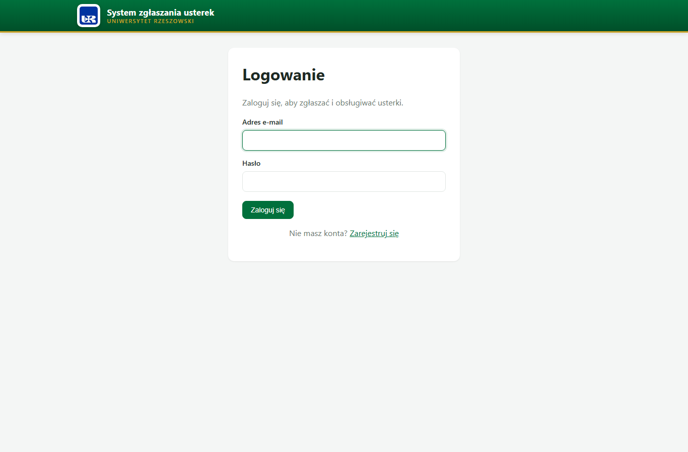</p>

#### 👤 Student (zgłaszający)
Tworzy zgłoszenia i widzi **wyłącznie własne**. Nie ma dostępu do mapy pięter ani do
paneli serwisowych i administracyjnych.

<table>
  <tr>
    <td width="50%"><b>Pulpit – lista własnych zgłoszeń</b><br>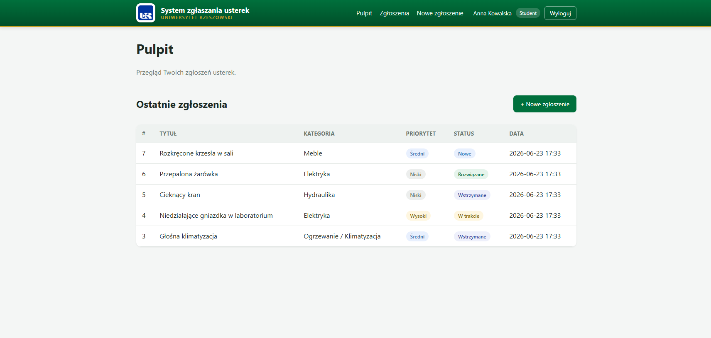</td>
    <td width="50%"><b>Nowe zgłoszenie</b><br>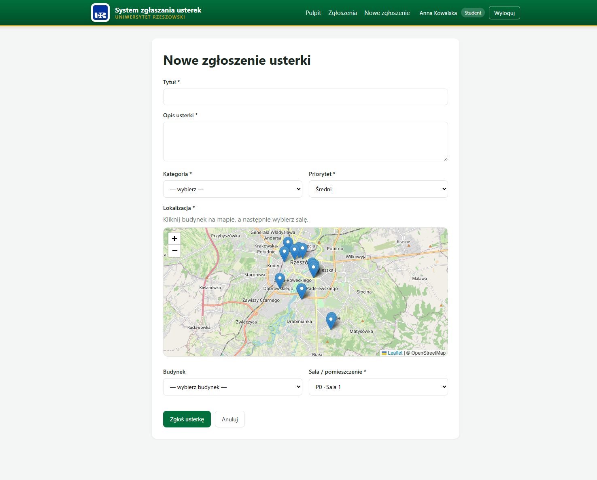</td>
  </tr>
  <tr>
    <td><b>Lista własnych zgłoszeń (filtry)</b><br>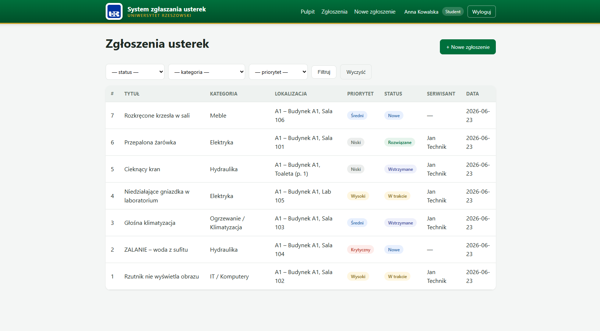</td>
    <td></td>
  </tr>
</table>

#### 🔧 Serwisant (technik)
Widzi i obsługuje **tylko zgłoszenia ze swojego zasięgu** (przypisane kategorie *oraz*
budynki) plus te przydzielone mu bezpośrednio. Może zmieniać status i przypisywać
technika; nie ma uprawnień administracyjnych.

<table>
  <tr>
    <td width="50%"><b>Pulpit – jego zasięg</b><br>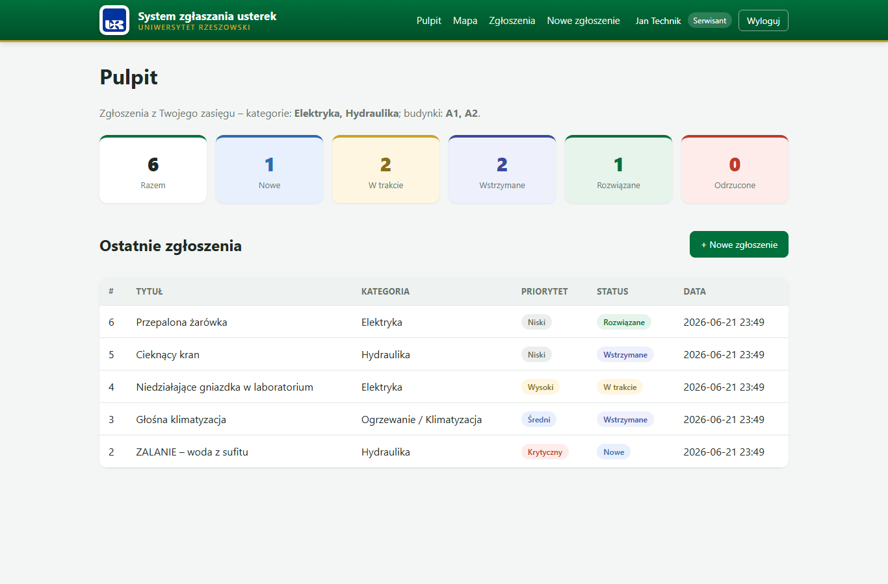</td>
    <td width="50%"><b>Lista – tylko jego kategorie/budynki</b><br>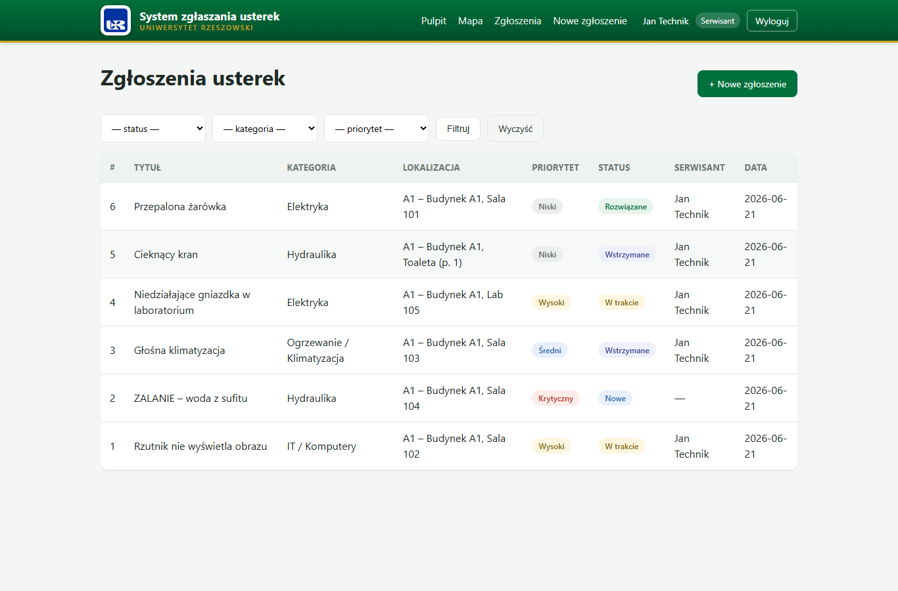</td>
  </tr>
  <tr>
    <td><b>Szczegóły + panel „Obsługa zgłoszenia”</b><br>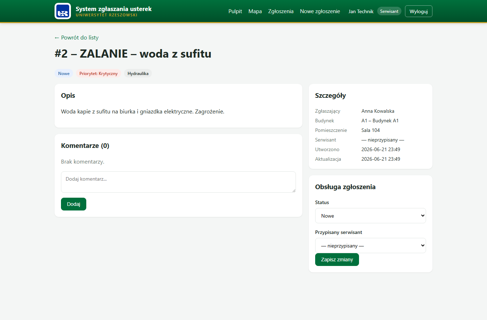</td>
    <td></td>
  </tr>
</table>

#### 🛠️ Administrator
Pełne uprawnienia: widzi **wszystkie** zgłoszenia, zarządza budynkami, pomieszczeniami
i użytkownikami oraz rozdysponowuje zgłoszenia spoza zasięgu serwisantów.

<table>
  <tr>
    <td width="50%"><b>Pulpit – cały system</b><br>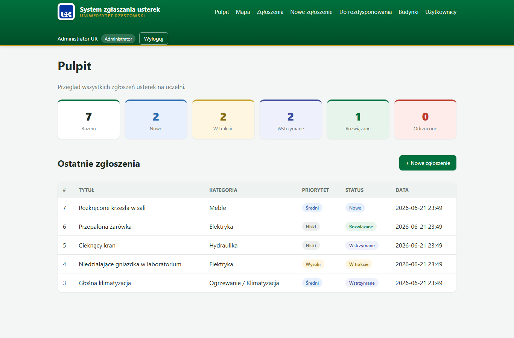</td>
    <td width="50%"><b>Do rozdysponowania</b><br>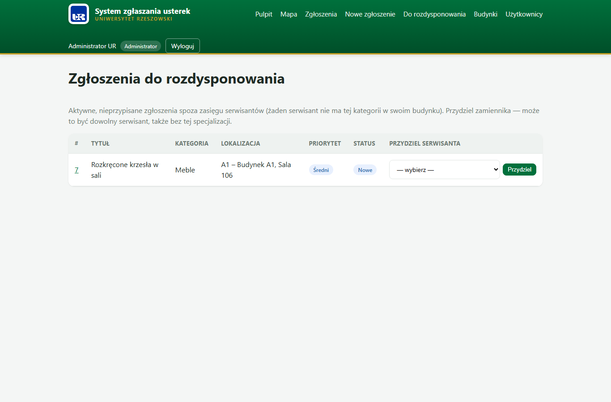</td>
  </tr>
  <tr>
    <td><b>Plan budynku – tryb podglądu</b><br>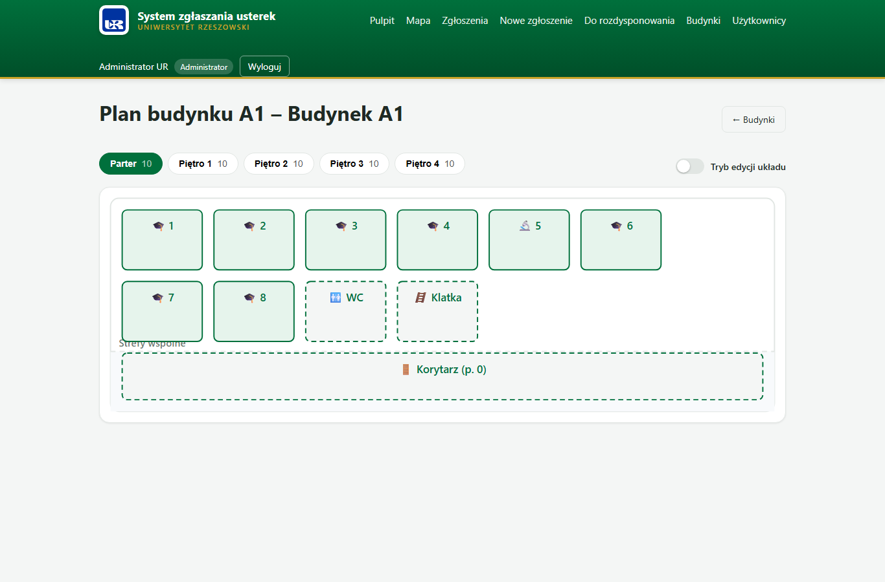</td>
    <td><b>Plan budynku – tryb edycji (drag &amp; drop)</b><br>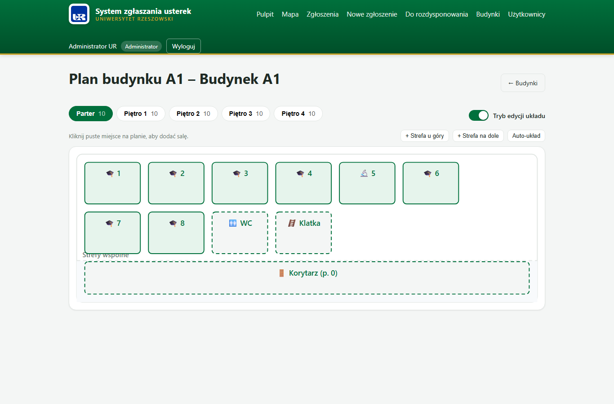</td>
  </tr>
  <tr>
    <td><b>Edycja serwisanta (zasięg)</b><br>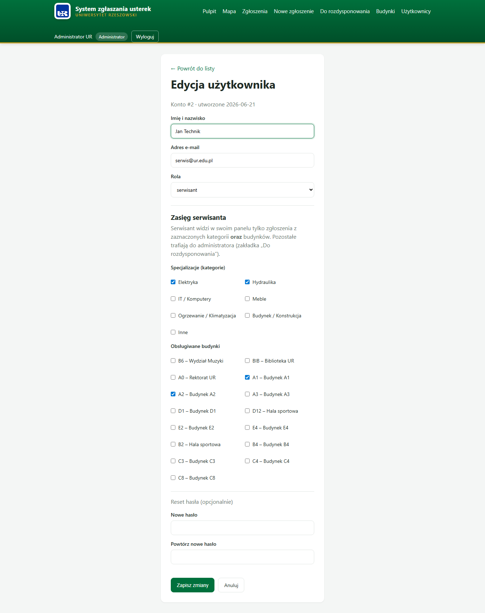</td>
    <td><b>Edycja szczegółów zgłoszenia</b><br>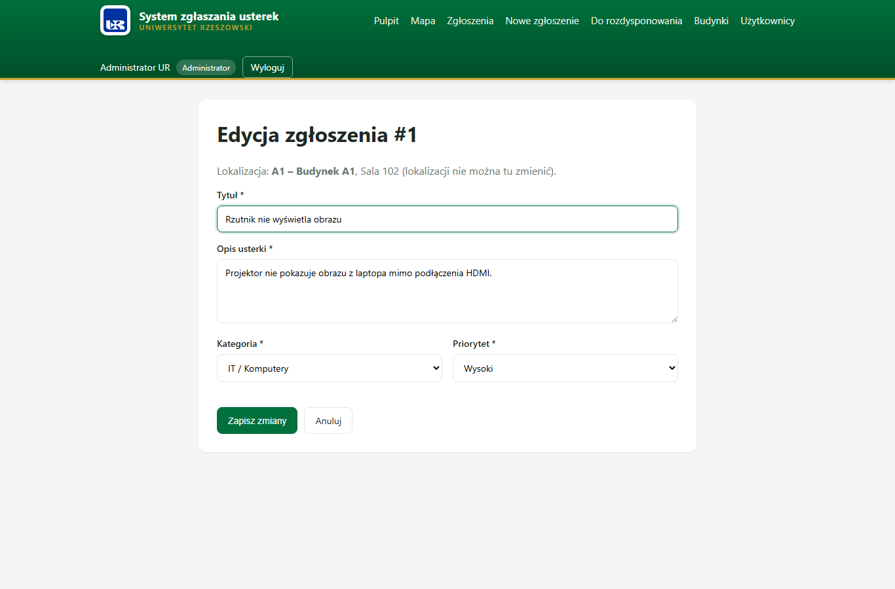</td>
  </tr>
</table>

---

## Uprawnienia ról — kto co może
Każdy widok respektuje rolę zalogowanego użytkownika. Zestawienie uprawnień:

| Funkcja / widok | Student | Serwisant | Administrator |
|---|:---:|:---:|:---:|
| Logowanie / rejestracja, „Moje konto” | ✅ | ✅ | ✅ |
| Tworzenie zgłoszenia | ✅ | ✅ | ✅ |
| Lista i szczegóły zgłoszeń | tylko **własne** | swój **zasięg** + przypisane | **wszystkie** |
| Komentarze pod zgłoszeniem | własne zgł. | zgł. w zasięgu | wszystkie |
| Mapa pięter (kolory i panel sali) | ❌ | swój **zasięg** | wszystkie |
| Pulpit – kafle statystyk statusów | ❌ | swój **zasięg** | wszystkie |
| Zmiana statusu / przypisanie serwisanta | ❌ | ✅ (w zasięgu) | ✅ |
| Edycja szczegółów zgłoszenia (tytuł, opis, kategoria, priorytet) | ❌ | ❌ | ✅ |
| Usuwanie zgłoszeń | ❌ | ❌ | ✅ |
| „Do rozdysponowania” (przydzielanie zamienników) | ❌ | ❌ | ✅ |
| Budynki i pomieszczenia (dodawanie/edycja) | ❌ | ❌ | ✅ |
| Użytkownicy (tworzenie, edycja, zasięg serwisanta) | ❌ | ❌ | ✅ |

> **Widoczność danych studenta:** student widzi wyłącznie własne zgłoszenia (na pulpicie
> i liście). Nie ma dostępu do mapy pięter ani do kafli statystyk na pulpicie — te widoki
> są zarezerwowane dla serwisanta (jego zasięg) i administratora (wszystko). Pozostałe
> role mają zakres zgodny z powyższą tabelą.

---

## Baza danych

### Diagram ERD
Schemat odzwierciedla model po uproszczeniu (z tabeli `reports` usunięto
zdublowane kolumny `budynek`/`pomieszczenie` – wynikają one teraz z relacji do
`locations`).


### Opis bazy danych
Baza to plik **SQLite** (`instance/usterki.db`), obsługiwany przez ORM
**SQLAlchemy**. Tworzy się automatycznie przy pierwszym uruchomieniu i — gdy jest
pusta — wypełnia danymi przykładowymi (`app/seed.py`). Tabele:

- **users** – konta użytkowników wraz z rolą i hasłem (hash). Jeden użytkownik może
  być autorem wielu zgłoszeń oraz serwisantem przypisanym do wielu zgłoszeń.
- **reports** – zgłoszenia usterek; powiązane z autorem, opcjonalnym serwisantem oraz
  lokalizacją (salą). Przechowują kategorię, priorytet, status i daty. Budynek
  i pomieszczenie nie są osobnymi kolumnami – wynikają z relacji do `locations`.
- **comments** – komentarze pod zgłoszeniami; powiązane ze zgłoszeniem i autorem
  (usuwane kaskadowo wraz ze zgłoszeniem).
- **buildings** – budynki kampusu (markery na mapie) ze współrzędnymi GPS.
- **locations** – pomieszczenia i strefy wspólne (sale, laboratoria, korytarze…)
  w budynkach, z dowolną geometrią planu piętra (`svg_x/svg_y/svg_w/svg_h` – pozycja
  i rozmiar ustawiane przez admina metodą drag & drop). Brak sztywnej siatki slotów,
  więc liczba sal na piętrze jest nieograniczona. Przynależność do budynku trzyma
  jedynie `building_id` (kod budynku wynika z relacji), a to, czy pomieszczenie jest
  przestrzenią wspólną, wynika z `typ` – nie ma więc osobnych, dublujących kolumn.
  Administrator dodaje kolejne pomieszczenia i piętra.
- **specjalizacje** – kategorie usterek przypisane serwisantowi (jego specjalizacje).
- **serwisant_budynki** – tabela łącząca (wiele-do-wielu): które budynki obsługuje
  dany serwisant.

---

## Wykorzystane biblioteki
- **Flask 3.0.3** – framework webowy (routing, szablony, obsługa żądań).
- **Flask-SQLAlchemy 3.1.1** – integracja ORM SQLAlchemy z Flask (modele, baza).
- **Flask-Login 0.6.3** – uwierzytelnianie, sesje i ochrona widoków (`login_required`).
- **Werkzeug** – bezpieczne haszowanie haseł (`generate/check_password_hash`).
- **Jinja2** – silnik szablonów HTML.
- **SQLite** – wbudowana, plikowa baza danych (bez osobnego serwera).
- **Leaflet 1.9.4 + OpenStreetMap** (frontend, z CDN) – mapa kampusu z markerami budynków.
- **HTML / CSS / JavaScript** – warstwa interfejsu (własny arkusz `style.css`).

---

## Dane potrzebne do konfiguracji podczas pierwszego uruchomienia
Aplikacja **nie wymaga ręcznej konfiguracji** – baza danych i dane przykładowe
tworzą się automatycznie. Opcjonalnie można nadpisać ustawienia zmiennymi środowiskowymi:

| Zmienna | Znaczenie | Domyślnie |
|---|---|---|
| `SECRET_KEY` | klucz do podpisywania sesji/ciasteczek | wartość wbudowana |
| `DATABASE_URL` | adres bazy danych | lokalny SQLite `instance/usterki.db` |
| `PORT` | port serwera | `8000` |

**Konta demonstracyjne** (tworzone automatycznie przy pierwszym uruchomieniu):

| Rola | E-mail | Hasło |
|------|--------|-------|
| Administrator | `admin@ur.edu.pl` | `admin123` |
| Serwisant | `serwis@ur.edu.pl` | `serwis123` |
| Student | `student@ur.edu.pl` | `student123` |

Konto serwisanta (Jan Technik) ma w danych przykładowych przypisany zasięg:
specjalizacje **Elektryka** i **Hydraulika** oraz budynki **A1** i **A2** – dzięki
temu od razu widać działanie filtrowania zasięgiem i zakładki „Do rozdysponowania”.

---

## Instrukcja uruchomienia aplikacji
Wymagany **Python 3.13**. W terminalu (PowerShell), w katalogu projektu:

```powershell
# 1. Utwórz wirtualne środowisko
python -m venv .venv

# 2. Aktywuj je
.\.venv\Scripts\Activate.ps1

# 3. Zainstaluj zależności
pip install -r requirements.txt

# 4. Uruchom aplikację
python run.py
```

Następnie otwórz w przeglądarce: **http://127.0.0.1:8000**

---

## Struktura projektu
```
Projekt PYTHON/
├── run.py                  # punkt wejścia (uruchomienie serwera)
├── config.py               # konfiguracja (klucz, baza danych)
├── requirements.txt        # zależności
├── README.md               # dokumentacja
└── app/
    ├── __init__.py         # fabryka aplikacji, rozszerzenia
    ├── models.py           # modele bazy: User, Report, Comment, Building, Location, Specjalizacja
    ├── auth.py             # logowanie, rejestracja, edycja konta
    ├── main.py             # zgłoszenia, mapa, rozdysponowanie, panel administratora
    ├── seed.py             # dane przykładowe (budynki, sale, zasięg serwisanta)
    ├── static/
    │   ├── style.css       # arkusz stylów
    │   └── img/ur-logo.png # logo Uniwersytetu Rzeszowskiego
    └── templates/          # szablony HTML (Jinja2)
```
